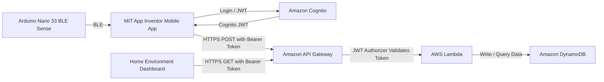

# Home Temperature and Humidity Monitoring System


## IoT Sensor Data Logger with AWS Serverless Backend

This project is an end-to-end **IoT temperature and humidity monitoring system** that collects home environment data from an Arduino-based sensor device, sends the data through a mobile app bridge, and stores it securely in AWS.

The backend is built using a **serverless architecture** with Amazon API Gateway, AWS Lambda, Amazon DynamoDB, and Amazon Cognito JWT authentication.

The project demonstrates:

- IoT sensor data collection
- Bluetooth Low Energy communication
- Mobile-to-cloud data ingestion
- Serverless backend development
- NoSQL time-series data storage
- Secure API access using Cognito-issued JWT tokens
- Dashboard-based data visualization

---

## Project Highlights

| Area | Implementation |
|---|---|
| Sensor Device | Arduino Nano 33 BLE Sense |
| Sensor Data | Temperature and humidity |
| Mobile Bridge | MIT App Inventor Android app |
| API Layer | Amazon API Gateway |
| Authentication | Amazon Cognito JWT authorizer |
| Compute | AWS Lambda |
| Database | Amazon DynamoDB |
| Dashboard | Home environment data visualization |
| Architecture | Serverless, event-driven, low-cost |

---

## Current Feature Status

| Feature | Status |
|---|---|
| Arduino sensor data collection | Done |
| BLE data transmission to mobile app | Done |
| MIT App Inventor mobile bridge | Done |
| API Gateway endpoint for data ingestion | Done |
| Lambda processing logic | Done |
| DynamoDB storage | Done |
| Dashboard visualization | Done locally |
| Cognito/JWT API authentication | Done |
| Cloud-hosted dashboard | Planned |
| Custom domain | Planned |
| Automated alerts | Planned |
| ESP32 direct AWS IoT Core integration | Planned |
| Infrastructure as Code | Planned |

---

## Architecture Overview

The system uses a serverless cloud architecture to keep the backend scalable, secure, and cost-efficient.



### System Architecture Diagram


### Dashboard Preview


---

## Data Flow

```text
Arduino Sensor
    ↓ BLE
MIT App Inventor Mobile App
    ↓ HTTPS POST + Cognito JWT
Amazon API Gateway
    ↓ JWT validation
AWS Lambda
    ↓ PutItem / Query
Amazon DynamoDB
    ↓ HTTPS GET + Cognito JWT
Home Environment Dashboard
```

1. The Arduino Nano 33 BLE Sense reads temperature and humidity data.
2. The sensor data is sent to the Android mobile app using Bluetooth Low Energy.
3. The mobile app authenticates through Amazon Cognito and obtains a JWT token.
4. The mobile app sends sensor data to API Gateway using an HTTPS POST request.
5. API Gateway validates the JWT token before invoking Lambda.
6. Lambda validates and processes the incoming JSON payload.
7. The processed sensor data is stored in DynamoDB.
8. The dashboard retrieves historical readings through a protected API route.

---

## Authentication and API Security

This project uses **Amazon Cognito-issued JWT tokens** to secure the API Gateway routes.

Clients must send requests with the following HTTP header:

```http
Authorization: Bearer <COGNITO_JWT>
```

API Gateway validates the JWT before invoking the Lambda function. Requests without a valid token are rejected before they reach the backend logic.

### Authentication Flow

```text
User / Mobile App / Dashboard
        ↓ Login
Amazon Cognito
        ↓ JWT Token
Client App
        ↓ Authorization: Bearer <JWT>
API Gateway JWT Authorizer
        ↓ Valid token only
AWS Lambda
        ↓
DynamoDB
```

### Token Usage

For API authorization, the recommended token type is the **Cognito access token**.

The ID token is mainly used for user identity information, while the access token is more suitable for API authorization and route-level scopes.

Example future scope design:

| Route | Recommended Scope |
|---|---|
| `GET /sensor-data` | `sensor/read` |
| `POST /sensor-data` | `sensor/write` |

---

## API Routes

> Note: This README uses `/sensor-data` as the example route.  
> If your deployed API currently uses `/data`, replace `/sensor-data` with `/data`.

| Method | Route | Description | Authentication |
|---|---|---|---|
| `POST` | `/sensor-data` | Upload temperature and humidity readings | Required |
| `GET` | `/sensor-data` | Retrieve stored sensor readings | Required |
| `OPTIONS` | `/sensor-data` | CORS preflight request | Public / CORS only |

---

## Example API Request

### POST Sensor Data

```bash
curl -X POST "https://your-api-id.execute-api.your-region.amazonaws.com/sensor-data" \
  -H "Content-Type: application/json" \
  -H "Authorization: Bearer <COGNITO_JWT>" \
  -d '{
    "deviceId": "home-sensor-001",
    "temperature": 25.6,
    "humidity": 61.4
  }'
```

### GET Sensor Data

```bash
curl -X GET "https://your-api-id.execute-api.your-region.amazonaws.com/sensor-data?deviceId=home-sensor-001&limit=50" \
  -H "Authorization: Bearer <COGNITO_JWT>"
```

---

## Example Payload

```json
{
  "deviceId": "home-sensor-001",
  "temperature": 25.6,
  "humidity": 61.4,
  "timestamp": "2026-09-12T10:30:00Z"
}
```

If the client does not provide a timestamp, Lambda can generate one using the current server time.

---

## DynamoDB Data Model

Recommended table name:

```text
SensorData
```

Recommended key design:

| Attribute | Type | Purpose |
|---|---|---|
| `deviceId` | String | Partition key |
| `timestamp` | String | Sort key, ISO-8601 timestamp |
| `temperature` | Number | Temperature reading |
| `humidity` | Number | Humidity reading |
| `ownerSub` | String | Optional Cognito user ID for device ownership |
| `createdAt` | String | Server-side creation timestamp |

Example item:

```json
{
  "deviceId": "home-sensor-001",
  "timestamp": "2026-09-12T10:30:00Z",
  "temperature": 25.6,
  "humidity": 61.4,
  "ownerSub": "cognito-user-sub",
  "createdAt": "2026-09-12T10:30:01Z"
}
```

Using `deviceId` as the partition key and `timestamp` as the sort key makes it easy to query readings for a specific device in chronological order.

---

## Security Test Cases

| Test Case | Expected Result |
|---|---|
| Call API without token | `401 Unauthorized` or `403 Forbidden` |
| Call API with invalid token | `401 Unauthorized` or `403 Forbidden` |
| Call API with expired token | `401 Unauthorized` or `403 Forbidden` |
| Call API with valid Cognito JWT | `200 OK` |
| Submit invalid JSON payload | `400 Bad Request` |
| Access another user's device data | `403 Forbidden` if device ownership check is enabled |

Example unauthenticated request:

```bash
curl -X GET "https://your-api-id.execute-api.your-region.amazonaws.com/sensor-data?deviceId=home-sensor-001"
```

Expected result:

```json
{
  "message": "Unauthorized"
}
```

---

## Recommended Security Design

API Gateway handles **authentication**.

Lambda can additionally handle **authorization**.

Recommended flow:

```text
JWT claim sub/email
        ↓
Check whether the user owns the requested deviceId
        ↓
Allow or deny DynamoDB query
```

This prevents an authenticated user from reading another user's sensor data.

Recommended implementation:

```text
API Gateway JWT Authorizer:
- Verifies JWT signature
- Checks token issuer
- Checks token audience
- Rejects invalid or expired tokens

Lambda:
- Validates request payload
- Reads Cognito claims from request context
- Checks device ownership
- Writes or queries DynamoDB
```

---

## Tech Stack

### Hardware

- Arduino Nano 33 BLE Sense
- Built-in HTS221 temperature and humidity sensor
- Bluetooth Low Energy

### Mobile

- MIT App Inventor
- Android device
- BLE extension / Bluetooth component
- HTTP Web component

### AWS Backend

- Amazon API Gateway
- Amazon Cognito
- AWS Lambda
- Amazon DynamoDB
- AWS IAM
- Amazon CloudWatch Logs

### Frontend Dashboard

- HTML / CSS / JavaScript or web dashboard framework
- API Gateway GET request
- Chart-based visualization
- Local development hosting

---

## Repository Structure

```text
.
├── arduino/
│   └── sensor_ble/
│       └── sensor_ble.ino
│
├── app/
│   └── home-monitoring-app.aia
│
├── backend/
│   ├── lambda/
│   │   └── index.js or lambda_function.py
│   └── README.md
│
├── dashboard/
│   ├── index.html
│   ├── style.css
│   └── script.js
│
├── docs/
│   ├── architecture.png
│   └── screenshots/
│
└── README.md
```

---

## Setup Instructions

## 1. Hardware Setup

### Requirements

- Arduino Nano 33 BLE Sense
- USB cable
- Arduino IDE
- Android phone with BLE support

### Steps

1. Open the Arduino sketch from the `arduino/` folder.
2. Install the required Arduino libraries.
3. Upload the sketch to the Arduino Nano 33 BLE Sense.
4. Confirm that the board is advertising data over Bluetooth Low Energy.
5. Use the mobile app to connect to the BLE device.

---

## 2. AWS Backend Setup

### 2.1 Create DynamoDB Table

Create a DynamoDB table:

```text
Table name: SensorData
Partition key: deviceId
Partition key type: String
Sort key: timestamp
Sort key type: String
```

Recommended capacity mode:

```text
On-demand
```

---

### 2.2 Create Lambda Function

Create a Lambda function using Node.js or Python.

Recommended environment variable:

```text
TABLE_NAME=SensorData
```

Attach an IAM role with least-privilege DynamoDB permissions.

Example IAM permission scope:

```json
{
  "Effect": "Allow",
  "Action": [
    "dynamodb:PutItem",
    "dynamodb:Query",
    "dynamodb:GetItem"
  ],
  "Resource": "arn:aws:dynamodb:<REGION>:<ACCOUNT_ID>:table/SensorData"
}
```

Lambda should handle:

- JSON body parsing
- Required field validation
- Timestamp generation
- DynamoDB write operation
- DynamoDB query operation
- Error handling
- Optional Cognito claim extraction

---

### 2.3 Create API Gateway

Create an Amazon API Gateway HTTP API.

Recommended routes:

```text
POST /sensor-data
GET /sensor-data
OPTIONS /sensor-data
```

Integrate the routes with the Lambda function.

Enable CORS for the dashboard and mobile app.

Recommended CORS settings for development:

```text
Allowed origins:
- http://localhost:3000
- http://localhost:5173
- http://localhost:8080

Allowed methods:
- GET
- POST
- OPTIONS

Allowed headers:
- Content-Type
- Authorization
```

For production, restrict CORS to your real dashboard domain only.

---

### 2.4 Configure Amazon Cognito

Create a Cognito User Pool.

Create an app client.

For a mobile app or browser-based dashboard, use a public app client without a client secret.

Then configure API Gateway with a JWT authorizer.

Example HTTP API JWT authorizer configuration:

```text
Issuer:
https://cognito-idp.<AWS_REGION>.amazonaws.com/<USER_POOL_ID>

Audience:
<APP_CLIENT_ID>

Identity source:
$request.header.Authorization
```

Attach the JWT authorizer to protected routes:

```text
POST /sensor-data
GET /sensor-data
```

After this is configured, API Gateway will reject requests that do not include a valid Cognito JWT.

---

## 3. Mobile App Setup

The mobile app is built with MIT App Inventor and acts as a bridge between the BLE sensor and AWS.

### Steps

1. Go to MIT App Inventor.
2. Import the `.aia` project file from the `app/` directory.
3. Open the Blocks editor.
4. Configure the BLE connection logic for the Arduino device.
5. Replace the placeholder API URL with your API Gateway Invoke URL.
6. Add the required request headers:

```http
Content-Type: application/json
Authorization: Bearer <COGNITO_JWT>
```

7. Build the APK.
8. Install the APK on an Android device.
9. Connect to the Arduino BLE device.
10. Send sensor readings to AWS.

---

## 4. Dashboard Setup

The dashboard retrieves stored sensor data from the protected API and visualizes temperature and humidity readings.

### Local Development

If the dashboard is a static HTML/CSS/JavaScript project, you can run it locally with:

```bash
cd dashboard
python3 -m http.server 8080
```

Then open:

```text
http://localhost:8080
```

Update the dashboard configuration with your API endpoint:

```javascript
const API_BASE_URL = "https://your-api-id.execute-api.your-region.amazonaws.com";
```

The dashboard should include the Cognito JWT in API requests:

```javascript
fetch(`${API_BASE_URL}/sensor-data?deviceId=home-sensor-001`, {
  method: "GET",
  headers: {
    "Authorization": `Bearer ${token}`
  }
});
```

---

## Error Handling

The backend should return clear status codes:

| Status Code | Meaning |
|---|---|
| `200` | Request successful |
| `201` | Sensor data stored successfully |
| `400` | Invalid request body |
| `401` | Missing, invalid, or expired JWT |
| `403` | Authenticated but not authorized |
| `404` | Device or route not found |
| `500` | Internal server error |

---

## CloudWatch Logging

Lambda logs can be inspected in Amazon CloudWatch.

Useful logs include:

- Incoming request method and route
- Parsed sensor payload
- DynamoDB write result
- DynamoDB query result
- Validation errors
- Authorization failures

Do not log:

- Full JWT tokens
- AWS credentials
- Cognito secrets
- Personal user information

---

## Security Notes

- Do not commit real JWT tokens to GitHub.
- Do not commit AWS access keys.
- Do not expose Cognito client secrets in frontend or mobile apps.
- Use least-privilege IAM permissions for Lambda.
- Restrict CORS origins in production.
- Use Cognito access tokens for API authorization.
- Add device-level authorization if multiple users or devices are supported.
- Rotate any credentials immediately if they were accidentally committed.

---

## Future Work

### Cloud Hosting and Custom Domain

The dashboard is currently developed and tested locally.

Planned improvements:

- Deploy the dashboard using Cloudflare Pages, AWS Amplify, or Amazon S3 with CloudFront.
- Bind the dashboard to a custom domain.
- Configure HTTPS.
- Restrict production CORS to the dashboard domain.

---

### Dashboard Access Control

Although the API is already protected by Cognito JWT authentication, the dashboard page itself should also be protected before production use.

Possible options:

- Amazon Cognito Hosted UI
- Cloudflare Zero Trust Access
- SSO-based login
- Email allowlist access

This would prevent unauthorized users from even loading the dashboard interface.

---

### Device-Level Authorization

Add a device ownership table or ownership attribute so that each Cognito user can only access their own devices.

Example design:

```text
Cognito user sub
        ↓
Device ownership mapping
        ↓
Allowed deviceId list
        ↓
DynamoDB query
```

This improves security beyond basic authentication.

---

### Automated Alerts

Add real-time alerts when temperature or humidity exceeds a defined threshold.

Possible integrations:

- AWS SNS
- Amazon EventBridge
- n8n webhook
- Email notification
- Telegram bot
- Slack webhook

Example alert conditions:

```text
Temperature > 30°C
Humidity > 75%
Temperature < 10°C
```

---

### Direct Cloud Integration with ESP32

A future hardware upgrade could replace the mobile app bridge with a Wi-Fi-enabled microcontroller such as ESP32.

Planned architecture:

```text
ESP32
    ↓ MQTT over TLS
AWS IoT Core
    ↓ IoT Rule
Lambda / DynamoDB
    ↓
Dashboard
```

Benefits:

- No mobile app bridge required
- Direct cloud connectivity
- MQTT-based communication
- Better scalability for multiple devices

---

### Infrastructure as Code

The backend can be improved by adding Infrastructure as Code.

Possible tools:

- AWS SAM
- AWS CDK
- Terraform
- Serverless Framework

This would make the project easier to deploy, reproduce, and maintain.

---

## What I Learned

This project helped me gain hands-on experience with:

- Building an end-to-end IoT data pipeline
- Reading sensor data from Arduino hardware
- Sending data over Bluetooth Low Energy
- Building a mobile app bridge with MIT App Inventor
- Designing a serverless AWS backend
- Securing API Gateway with Cognito JWT authentication
- Writing Lambda functions for API processing
- Storing time-series data in DynamoDB
- Visualizing sensor data in a dashboard
- Applying cloud security best practices

---

## Summary

This project demonstrates a secured serverless IoT monitoring system using:

```text
Arduino Nano 33 BLE Sense
+ MIT App Inventor Mobile App
+ Amazon Cognito
+ Amazon API Gateway
+ AWS Lambda
+ Amazon DynamoDB
+ Home Environment Dashboard
```

It provides a practical example of how IoT sensor data can be collected, transmitted, secured, stored, and visualized using modern cloud-native services.


